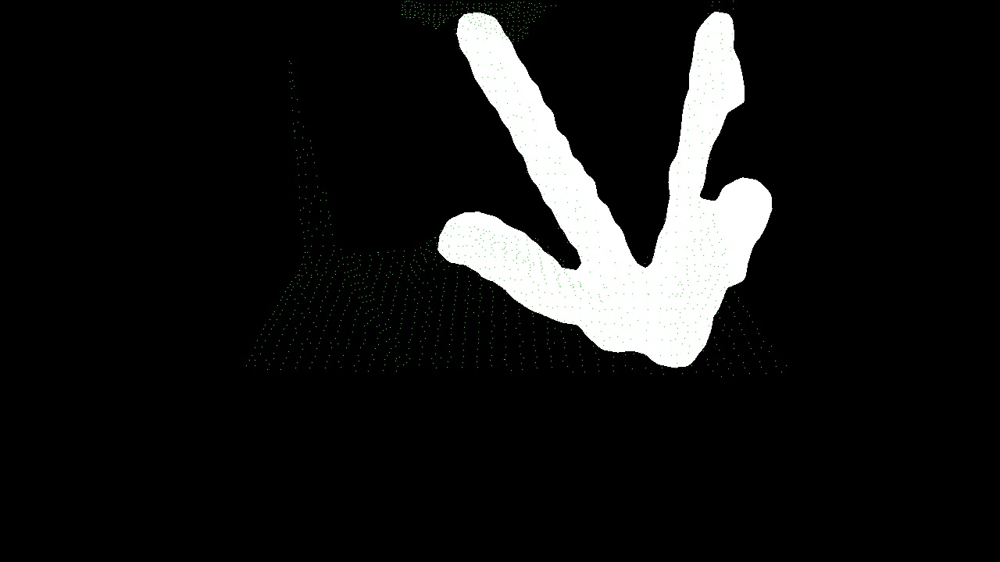

# ObjectTracker

ObjectTracker is a minimal working solution to the problem of performing object tracking and pose estimation of a particular object in a scene. For our initial use-case the object is the corner joint of a truss.

This solution leverages both the depth data and the RGB data provided by Intel's d435i Depth Camera.  A Mask-RCNN was developed to provide an mask which is used as detailed in the steps below.  The details of the Mask-RCNN are included in a separate repository.

## Pipeline Steps
1) Scan the scene: Acquire depth scan and associated RGB image.

2) Classify, Bound, and Mask Object: Using pybind11 pass an opencv image matrix obtained by realsense to the method ClassifyCornerJoint which resides in truss.py.

Bound Truss:


Masked Truss:


3) Obtain bounding box pixel coordinates

4) Create bit mask


5) Create 3-D Channel of Interest: Deproject the pixel coordinates of the bounding box to their corresponding depth data points from the depth image obtained in step 1.  The deprojected (x,y) coordinates of the bounding box serve as upper and lower depth data limits for x and y values in the depth data.
These x and y values are used for cropping. The result is a 3-D rectangular slice in which the truss joint occurs.

  

6) Cluster 3-D Channel of Interest: Using the subset of depth data obtained in step 5, cluster out groups of 3D points using a flood-fill clustering method.

7) Score Each Cluster:  Here we developed a scoring system that leverages the bit mask created in step 4 along with the clusters obtained in step 6.  For each cluster we project the entire 3-d cluster into the bit map.  Every time a point in a cluster projects into the bit mask a point is awarded to the cluster.  The cluster with the highest score at the end is the cluster most likely to obtain

 

8) Filter and Compute Centroid: The winning cluster is then filtered and reduced to only those 3-D points which project into the pixel.  Using this set of points we compute a centroid and obtain the pose estimation with respect to the position of the realsense.
Cluster filtered to points that scored:

 


## Requirements
This project uses an older version of TensorFlow for the classification which is incompatible with python versions > 3.6.x.  Consequently, it is best run in a virtual environment using pyenv and virtualenv.

python 3.6.9

librealsense

pcl

opencv

See requirements.txt for python module dependencies


## Usage

```python
#In directory containing CMakeLists.txt
mkdir build && cd build
cd ..
#For live usage with realsense
./ObjectTracker
#For demo with sample data 
./ObjectTracker -d
```

